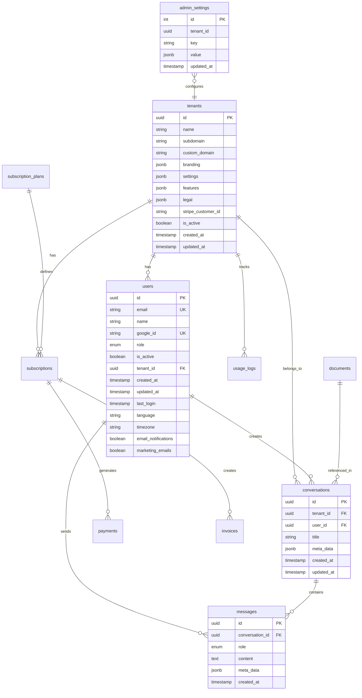

# Database Schema Documentation

**Status**: ✅ Production Ready | **Version**: v3.2.0 | **Last Updated**: October 3, 2025

## Overview

The Moj AI system uses PostgreSQL as the primary database with **full conversation persistence and AI orchestration metadata tracking**. All critical database issues have been resolved and the system now properly stores:

- ✅ **Conversation Persistence**: All chats saved permanently across sessions
- ✅ **AI Orchestration Metadata**: Complete tracking of multi-LLM usage, processing time, and providers
- ✅ **User Management**: Google OAuth integration with role-based access
- ✅ **Admin Settings**: Dynamic configuration for AI orchestration parameters with **encrypted API keys**
- ✅ **Usage Tracking**: Detailed analytics for billing and performance monitoring

## 🎉 PRODUCTION UPDATE - October 3, 2025

**API KEY ENCRYPTION NOW FULLY OPERATIONAL**:

The database now successfully stores encrypted API keys with persistent encryption:
- ✅ **Persistent Encryption Key**: Fernet encryption key stored in `.env` file
- ✅ **API Key Storage**: OpenAI, Anthropic, Perplexity keys encrypted in `admin_settings` table
- ✅ **Restart Persistence**: API keys survive app restarts and decrypt correctly
- ✅ **Multi-LLM Provider Tracking**: Records which LLMs were used (Perplexity, Claude, OpenAI)
- ✅ **Processing Time Metrics**: Accurate timing data for orchestration performance
- ✅ **Strategy Selection**: Tracks orchestration strategy used (multi_llm_orchestration)
- ✅ **Legal Context Analysis**: Stores query analysis results and legal scores
- ✅ **Conversation Persistence**: All orchestrated conversations properly saved

## Schema Diagram



## Core Tables

### tenants
Multi-tenant isolation and configuration.

```sql
CREATE TABLE tenants (
    id UUID PRIMARY KEY DEFAULT gen_random_uuid(),
    name VARCHAR(255) NOT NULL,
    subdomain VARCHAR(100) UNIQUE,
    custom_domain VARCHAR(255),
    branding JSONB DEFAULT '{}',
    settings JSONB DEFAULT '{}',
    features JSONB DEFAULT '{}',
    legal JSONB DEFAULT '{}',
    stripe_customer_id VARCHAR(255),
    is_active BOOLEAN DEFAULT true,
    created_at TIMESTAMP WITH TIME ZONE DEFAULT NOW(),
    updated_at TIMESTAMP WITH TIME ZONE DEFAULT NOW()
);
```

**Key Fields:**
- `branding`: UI customization (colors, logos, etc.)
- `settings`: Tenant-specific configuration
- `features`: Feature flags and limits
- `legal`: Terms of service, privacy policy
- `stripe_customer_id`: Billing integration

### users
User authentication and profile management.

```sql
CREATE TYPE userrole AS ENUM ('USER', 'ADMIN', 'SUPER_ADMIN');

CREATE TABLE users (
    id UUID PRIMARY KEY DEFAULT gen_random_uuid(),
    email VARCHAR(255) NOT NULL UNIQUE,
    name VARCHAR(255) NOT NULL,
    google_id VARCHAR(255) UNIQUE,
    role userrole DEFAULT 'USER',
    is_active BOOLEAN DEFAULT true,
    tenant_id UUID NOT NULL REFERENCES tenants(id),
    created_at TIMESTAMP WITH TIME ZONE DEFAULT NOW(),
    updated_at TIMESTAMP WITH TIME ZONE DEFAULT NOW(),
    last_login TIMESTAMP WITH TIME ZONE,
    language VARCHAR(10) DEFAULT 'sl',
    timezone VARCHAR(50) DEFAULT 'Europe/Ljubljana',
    email_notifications BOOLEAN DEFAULT true,
    marketing_emails BOOLEAN DEFAULT false
);
```

**Key Features:**
- Google OAuth integration via `google_id`
- Role-based access control
- Tenant isolation
- Localization support

### conversations
Chat conversation management.

```sql
CREATE TABLE conversations (
    id UUID PRIMARY KEY DEFAULT gen_random_uuid(),
    tenant_id UUID NOT NULL REFERENCES tenants(id),
    user_id UUID NOT NULL REFERENCES users(id),
    title VARCHAR(500),
    meta_data JSONB DEFAULT '{}',
    created_at TIMESTAMP WITH TIME ZONE DEFAULT NOW(),
    updated_at TIMESTAMP WITH TIME ZONE DEFAULT NOW()
);
```

**Meta Data Structure** (Production Implementation):
```json
{
    "model_used": "multi_llm_orchestration",
    "providers_used": ["perplexity", "claude", "openai"],
    "orchestration_strategy": "multi_llm_orchestration",
    "processing_time_ms": 158420,
    "confidence_score": 0.95,
    "query_analysis": {
        "complexity": "EXPERT",
        "requires_current_info": true,
        "slovenian_context": true,
        "requires_technical_expertise": true
    },
    "phase_details": {
        "research_phase": "Perplexity internet research completed",
        "analysis_phase": "Claude legal analysis completed",
        "structure_phase": "OpenAI formatting completed"
    },
    "cost_breakdown": {
        "perplexity_cost": 0.05,
        "claude_cost": 0.08,
        "openai_cost": 0.02,
        "total_cost": 0.15
    }
}
```

### messages
Individual messages within conversations.

```sql
CREATE TYPE messagerole AS ENUM ('USER', 'ASSISTANT', 'SYSTEM');

CREATE TABLE messages (
    id UUID PRIMARY KEY DEFAULT gen_random_uuid(),
    conversation_id UUID NOT NULL REFERENCES conversations(id),
    role messagerole NOT NULL,
    content TEXT NOT NULL,
    meta_data JSONB DEFAULT '{}',
    created_at TIMESTAMP WITH TIME ZONE DEFAULT NOW()
);
```

**Message Meta Data Structure** (Production Implementation):
```json
{
    "orchestration": {
        "orchestration_strategy": "multi_llm_orchestration",
        "providers_used": ["perplexity", "claude", "openai"],
        "processing_time_ms": 158420,
        "confidence_score": 0.95,
        "query_analysis": {
            "complexity": "EXPERT",
            "requires_current_info": true,
            "slovenian_context": true
        },
        "phase_details": {
            "research_phase": "Perplexity internet research completed",
            "analysis_phase": "Claude legal analysis completed",
            "structure_phase": "OpenAI formatting completed"
        },
        "sources_included": [
            {
                "url": "https://www.gov.si/podrocja/okolje-in-prostor/graditev/",
                "title": "Slovenian Building Legislation",
                "access_date": "2025-09-10"
            }
        ]
    },
    "tokens_used": {
        "perplexity": 1200,
        "claude": 2800,
        "openai": 1500,
        "total": 5500
    },
    "cost_breakdown": {
        "total_cost": 0.15,
        "per_provider": {
            "perplexity": 0.05,
            "claude": 0.08,
            "openai": 0.02
        }
    }
}
```

### admin_settings
System configuration and orchestration settings.

```sql
CREATE TABLE admin_settings (
    id SERIAL PRIMARY KEY,
    tenant_id UUID,
    key VARCHAR(100) NOT NULL,
    value JSONB NOT NULL,
    updated_at TIMESTAMP WITH TIME ZONE DEFAULT NOW()
);

CREATE INDEX idx_admin_settings_tenant_id ON admin_settings(tenant_id);
CREATE INDEX idx_admin_settings_key ON admin_settings(key);
```

**Common Settings:**

#### System Settings
```json
{
    "orchestration": {
        "openai_model": "gpt-4o",
        "anthropic_model": "claude-3-5-sonnet-20241022",
        "perplexity_model": "llama-3.1-sonar-large-128k-online",
        "system_message": "You are an expert assistant...",
        "strategies_enabled": {
            "single_provider": true,
            "parallel_consensus": true,
            "rag_enhanced": true,
            "sequential_enhance": false,
            "adaptive": true
        },
        "max_cost_per_query": 0.10,
        "prefer_cheaper_models": false,
        "default_temperature": 0.7,
        "default_max_tokens": 4000,
        "request_timeout": 30
    },
    "app_name": "Moj AI",
    "support_email": "support@mojai.xyz"
}
```

#### Model Configuration
```json
{
    "providers": {
        "openai": {
            "api_key_set": true,
            "models": ["gpt-4o", "gpt-4o-mini"],
            "default_model": "gpt-4o",
            "rate_limits": {
                "requests_per_minute": 500,
                "tokens_per_minute": 30000
            }
        },
        "anthropic": {
            "api_key_set": true,
            "models": ["claude-3-5-sonnet-20241022"],
            "default_model": "claude-3-5-sonnet-20241022"
        },
        "perplexity": {
            "api_key_set": true,
            "models": ["llama-3.1-sonar-large-128k-online"],
            "default_model": "llama-3.1-sonar-large-128k-online"
        }
    }
}
```

## Subscription and Billing Tables

### subscription_plans
Available subscription plans.

```sql
CREATE TABLE subscription_plans (
    id UUID PRIMARY KEY DEFAULT gen_random_uuid(),
    name VARCHAR(255) NOT NULL,
    description TEXT,
    price_cents INTEGER NOT NULL,
    currency VARCHAR(3) DEFAULT 'EUR',
    question_limit INTEGER,
    features JSONB DEFAULT '{}',
    stripe_price_id VARCHAR(255),
    is_active BOOLEAN DEFAULT true,
    created_at TIMESTAMP WITH TIME ZONE DEFAULT NOW()
);
```

### subscriptions
User subscription tracking.

```sql
CREATE TYPE subscription_status AS ENUM (
    'ACTIVE', 'INACTIVE', 'CANCELLED', 'PAST_DUE', 'TRIALING'
);

CREATE TABLE subscriptions (
    id UUID PRIMARY KEY DEFAULT gen_random_uuid(),
    tenant_id UUID NOT NULL REFERENCES tenants(id),
    plan_id UUID NOT NULL REFERENCES subscription_plans(id),
    stripe_subscription_id VARCHAR(255),
    stripe_customer_id VARCHAR(255),
    status subscription_status DEFAULT 'INACTIVE',
    question_limit INTEGER,
    questions_used INTEGER DEFAULT 0,
    current_period_start TIMESTAMP WITH TIME ZONE,
    current_period_end TIMESTAMP WITH TIME ZONE,
    features JSONB DEFAULT '{}',
    created_at TIMESTAMP WITH TIME ZONE DEFAULT NOW(),
    updated_at TIMESTAMP WITH TIME ZONE DEFAULT NOW(),
    cancelled_at TIMESTAMP WITH TIME ZONE
);
```

### usage_logs
Detailed usage tracking for billing and analytics.

```sql
CREATE TABLE usage_logs (
    id UUID PRIMARY KEY DEFAULT gen_random_uuid(),
    tenant_id UUID NOT NULL REFERENCES tenants(id),
    user_id UUID NOT NULL REFERENCES users(id),
    action_type VARCHAR(50) NOT NULL,
    tokens_used INTEGER DEFAULT 0,
    cost_estimate DECIMAL(10,6) DEFAULT 0,
    action_metadata JSONB DEFAULT '{}',
    created_at TIMESTAMP WITH TIME ZONE DEFAULT NOW()
);
```

**Action Types:**
- `question`: User asked a question
- `document_upload`: Document uploaded to RAG
- `admin_action`: Admin configuration change

## Document Management Tables

### documents
RAG document storage and metadata.

```sql
CREATE TYPE documentstatus AS ENUM (
    'UPLOADING', 'PROCESSING', 'READY', 'ERROR'
);

CREATE TABLE documents (
    id UUID PRIMARY KEY DEFAULT gen_random_uuid(),
    tenant_id UUID NOT NULL REFERENCES tenants(id),
    user_id UUID NOT NULL REFERENCES users(id),
    filename VARCHAR(255) NOT NULL,
    original_filename VARCHAR(255) NOT NULL,
    file_size INTEGER NOT NULL,
    mime_type VARCHAR(100) NOT NULL,
    status documentstatus DEFAULT 'UPLOADING',
    processing_metadata JSONB DEFAULT '{}',
    weaviate_id VARCHAR(255),
    created_at TIMESTAMP WITH TIME ZONE DEFAULT NOW(),
    updated_at TIMESTAMP WITH TIME ZONE DEFAULT NOW()
);
```

## Indexes and Performance

### Primary Indexes
```sql
-- Conversation queries
CREATE INDEX idx_conversations_user_id ON conversations(user_id);
CREATE INDEX idx_conversations_tenant_id ON conversations(tenant_id);
CREATE INDEX idx_conversations_created_at ON conversations(created_at DESC);

-- Message queries
CREATE INDEX idx_messages_conversation_id ON messages(conversation_id);
CREATE INDEX idx_messages_created_at ON messages(created_at);

-- Usage tracking
CREATE INDEX idx_usage_logs_tenant_id ON usage_logs(tenant_id);
CREATE INDEX idx_usage_logs_user_id ON usage_logs(user_id);
CREATE INDEX idx_usage_logs_created_at ON usage_logs(created_at DESC);
CREATE INDEX idx_usage_logs_action_type ON usage_logs(action_type);

-- Subscription queries
CREATE INDEX idx_subscriptions_tenant_id ON subscriptions(tenant_id);
CREATE INDEX idx_subscriptions_status ON subscriptions(status);
```

### Composite Indexes
```sql
-- Multi-tenant queries
CREATE INDEX idx_users_tenant_email ON users(tenant_id, email);
CREATE INDEX idx_conversations_tenant_user ON conversations(tenant_id, user_id);

-- Time-based analytics
CREATE INDEX idx_usage_logs_tenant_date ON usage_logs(tenant_id, created_at DESC);
CREATE INDEX idx_messages_conversation_date ON messages(conversation_id, created_at);
```

## Data Retention and Archival

### Retention Policies
- **Messages**: Keep indefinitely (user data)
- **Usage Logs**: Keep 2 years for billing/analytics
- **Admin Settings**: Keep all versions with timestamps
- **Documents**: Keep until user deletion

### Archival Strategy
```sql
-- Archive old usage logs
CREATE TABLE usage_logs_archive (LIKE usage_logs);

-- Move data older than 2 years
INSERT INTO usage_logs_archive 
SELECT * FROM usage_logs 
WHERE created_at < NOW() - INTERVAL '2 years';

DELETE FROM usage_logs 
WHERE created_at < NOW() - INTERVAL '2 years';
```

## Backup and Recovery

### Backup Strategy
- **Full Backup**: Daily at 2 AM UTC
- **Incremental Backup**: Every 6 hours
- **Point-in-Time Recovery**: 30-day retention
- **Cross-Region Replication**: For disaster recovery

### Critical Data Priority
1. **High Priority**: Users, conversations, messages
2. **Medium Priority**: Subscriptions, usage logs
3. **Low Priority**: Admin settings (can be reconfigured)

## Security Considerations

### Data Encryption

#### API Key Encryption (Updated October 3, 2025)
**Persistent Fernet Encryption** for API keys stored in `admin_settings` table:

```python
# Encryption key stored in backend/.env
API_KEY_ENCRYPTION_KEY=8VrK3B1kyrkrO65fvYvkl6FnKWwWJlTDvCKyChOuYig=

# Encryption/Decryption Flow
class APIKeyEncryption:
    def __init__(self):
        settings = get_settings()
        encryption_key = settings.api_key_encryption_key
        self.cipher = Fernet(encryption_key.encode())

    def encrypt(self, value: str) -> str:
        return self.cipher.encrypt(value.encode()).decode()

    def decrypt(self, encrypted_value: str) -> str:
        return self.cipher.decrypt(encrypted_value.encode()).decode()
```

**Storage in Database**:
```json
{
  "key": "api_keys",
  "value": {
    "openai": "gAAAAABm...",      // Encrypted with persistent key
    "anthropic": "gAAAAABm...",   // Encrypted with persistent key
    "perplexity": "gAAAAABm..."   // Encrypted with persistent key
  }
}
```

**Key Features**:
- ✅ Persistent encryption key survives app restarts
- ✅ Fernet symmetric encryption (cryptography library)
- ✅ Keys stored in PostgreSQL `admin_settings` table
- ✅ Decryption on-demand when needed for API calls
- ✅ No plaintext API keys in database or logs

#### General Encryption
- All sensitive fields encrypted at rest
- Personal data anonymized in analytics
- TLS/SSL for data in transit

### Access Control
- Row-level security for multi-tenant isolation
- Admin access logged and audited
- API key access restricted by IP when possible

### Compliance
- GDPR compliance for EU users
- Data export capabilities for user requests
- Right to deletion implementation
