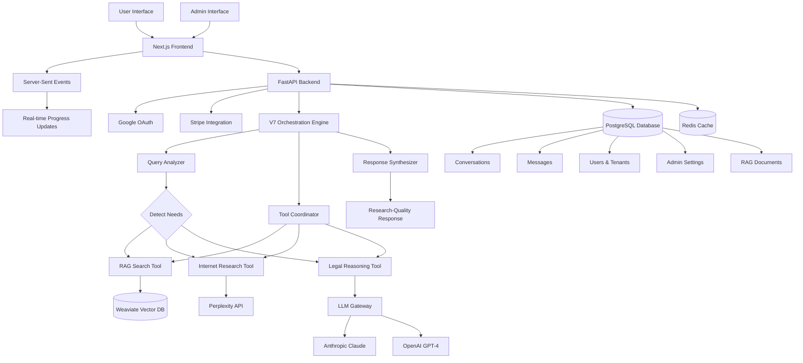

# System Architecture Overview

**Status**: ✅ V7 OPERATIONAL + RAG Quality Verification Complete | **Version**: v7.1.0 | **Last Updated**: October 10, 2025

## 🎯 **CURRENT STATUS: V7 ORCHESTRATION + RAG QUALITY VERIFICATION OPERATIONAL**

Moj AI is a multi-tenant SaaS application providing AI-powered assistance for Slovenian building legislation. The V7 orchestration system is fully operational with complete RAG Quality Verification System.

### **V7 Orchestration Status**:
- ✅ **API Key Decryption Fixed**: Double decryption bug resolved (Oct 9, 2025)
- ✅ **Claude API Working**: Legal reasoning tool now receives valid API keys
- ✅ **Intelligent Query Analysis**: Automatic detection of RAG/internet research needs
- ✅ **Admin-First Architecture**: Settings applied immediately (no singleton pattern)
- ✅ **Multi-Source Intelligence**: RAG + Internet Research + LLM knowledge
- ✅ **Real-Time Progress**: SSE implemented with progress tracking
- ✅ **Research-Quality Responses**: 10,000-25,000 character responses verified
- ✅ **Orchestration Transparency**: Full reports with tools used, sources, processing time

### **RAG Quality Verification Status** ⭐ NEW v3.0:
- ✅ **Quality Score Calculation**: 0-100 scoring for all documents
- ✅ **Admin Quality Dashboard**: Document management with quality badges
- ✅ **RAG Testing Interface**: `/admin/rag-testing` for query testing
- ✅ **User Document Upload**: Quality validation prevents bad files
- ✅ **Enhanced User Chat**: Prominent sources display with type icons
- ✅ **100% Processing Success**: All test documents processed correctly

### **Current System Features**:
- ✅ **Authentication**: Google OAuth integration
- ✅ **Billing**: Stripe subscription management
- ✅ **Database**: PostgreSQL, Weaviate, Redis
- ✅ **RAG System**: Multimodal document processing
- ✅ **Admin UI**: Configuration management
- ✅ **V7 Orchestration**: Operational with Claude Sonnet 4.5

## High-Level Architecture

## Core Components

### 1. Frontend Layer (Next.js 14)
- **User Interface**: Clean chat interface with real-time progress indicators
- **Conversation Management**: Create, rename, delete, persist conversations
- **Admin Panel**: Configuration interface for V7 orchestration settings
- **Authentication**: Google OAuth integration with role-based access
- **State Management**: React hooks and context for auth, usage, language, settings
- **Real-time Features**: Server-Sent Events for live progress updates
- **Orchestration Report**: Display tools used, processing time, confidence scores
- **File Upload**: Document attachment with RAG integration
- **Voice Input**: Speech-to-text functionality
- **Language Selection**: English ↔ Slovenian switching
- **Styling**: Tailwind CSS with Shadcn/ui components

### 2. Backend API (FastAPI)
- **REST API**: RESTful endpoints for all operations
- **Authentication**: JWT-based auth with Google OAuth
- **Real-time Streaming**: Server-Sent Events for progress updates
- **V7 Orchestration**: Intelligent multi-tool coordination
- **Database Integration**: PostgreSQL with conversation persistence
- **Middleware**: CORS, performance monitoring, error handling
- **Validation**: Pydantic models for request/response validation

### 3. V7 AI Orchestration Engine 🚧 **READY FOR IMPLEMENTATION**

**Architecture**: No singleton pattern - new engine created per request

**Components**:
- **Query Analyzer**: Detects RAG, internet research, legal reasoning needs
- **Tool Coordinator**: Executes tools in correct order with context passing
- **Response Synthesizer**: Combines results with citations and sources

**Tools**:
- 🚧 **RAG Search Tool**: Queries Weaviate for legal documents (Odlok_OPN_MOL_ID.pdf, etc.)
- 🚧 **Internet Research Tool**: Uses Perplexity for current prices, forms, market data
- 🚧 **Legal Reasoning Tool**: Uses lead orchestrator (Claude/GPT-4) for analysis
- 🚧 **Form Discovery Tool**: Finds government forms and applications
- 🚧 **Source Validation Tool**: Validates sources and citations
- 🚧 **Quality Validation Tool**: Ensures response quality and completeness

**Features**:
- 🚧 **Intelligent Detection**: Automatically detects when RAG/internet research needed
- 🚧 **Admin Control**: Settings applied immediately (no singleton!)
- 🚧 **Real-Time Progress**: Specific progress messages ("Searching legal documents...")
- 🚧 **Research Quality**: 5-10 page responses with inline citations [1], [2], [3]
- 🚧 **Orchestration Reports**: Shows tools used, processing time, confidence
- 🚧 **Multi-Source**: Combines RAG + Internet + LLM knowledge

**Documentation**: See [architecture/v7/](v7/) for complete specifications

### 4. Admin Settings Service
- **Configuration Management**: Stores orchestration settings in database
- **Lead Orchestrator Config**: Provider, model, temperature, max_tokens
- **Master System Message**: Configurable system message for orchestration
- **Hot Reload**: Settings applied immediately to new queries
- **Caching**: Redis caching for performance

### 5. Database Layer (PostgreSQL)
- **Multi-tenant Architecture**: Isolated data per tenant
- **Conversation Management**: All CRUD operations with persistence
- **User Management**: Authentication and authorization
- **Admin Settings**: Orchestration configuration storage
- **RAG Documents**: Document metadata and processing status
- **Usage Tracking**: Detailed analytics and billing data

### 6. RAG System (Weaviate)
- **Document Storage**: Slovenian legal documents and regulations
- **Vector Search**: Hybrid search (vector + keyword)
- **Collections**: `legal_documents` (admin), `user_documents` (user)
- **Multimodal Support**: PDFs (including scanned), DOC/DOCX, text files
- **Chunking Strategy**: 500-1000 tokens with 100 token overlap
- **Metadata**: Municipality, area, document type, page numbers
- **Current Documents**: Odlok_OPN_MOL_ID.pdf (6.0 MB, 9 chunks), 220528_OPN_MOM.pdf (2.0 MB, 80 chunks)

### 7. LLM Gateway
- **Provider Abstraction**: Unified interface for Anthropic, OpenAI, Perplexity
- **Model Selection**: Dynamic model selection from admin settings
- **Fallback Logic**: Handles provider failures gracefully
- **Cost Tracking**: Tracks token usage and costs per provider

## Data Flow

### V7 Query Processing Flow 🚧 **IMPLEMENTATION READY**

1. **User Input**: Query submitted through frontend chat interface
2. **Authentication**: JWT validation and tenant identification
3. **Admin Settings Load**: Get current orchestration settings from database
4. **Engine Creation**: Create NEW V7 orchestration engine (no singleton!)
5. **Query Analysis**: Analyze query to detect needs (RAG, internet, legal)
6. **Tool Selection**: Select required tools based on analysis
7. **Tool Execution**: Execute tools in sequence with context passing
   - **RAG Search** (if needed): Query Weaviate for legal documents
   - **Internet Research** (if needed): Query Perplexity for current info
   - **Legal Reasoning**: Use lead orchestrator with RAG/internet context
8. **Response Synthesis**: Combine tool results with citations
9. **Quality Validation**: Verify response quality and completeness
10. **Real-time Progress**: Send specific progress updates via SSE
11. **Database Persistence**: Save conversation and orchestration metadata
12. **Orchestration Report**: Return tools used, processing time, confidence

### Admin Configuration Flow

1. **Admin Login**: Authenticated admin access
2. **Settings Update**: Configuration changes via admin panel
3. **Database Persistence**: Settings saved to admin_settings table
4. **Cache Invalidation**: Redis cache cleared for admin settings
5. **Immediate Effect**: Next query uses new settings (no restart needed)
6. **Validation**: Settings validated before application

## Security Architecture

### Authentication & Authorization
- **JWT Tokens**: Secure token-based authentication
- **Tenant Isolation**: Multi-tenant data separation
- **Role-Based Access**: Admin vs user permissions
- **API Key Management**: Secure storage of LLM provider keys

### Data Protection
- **Encryption**: All sensitive data encrypted at rest
- **HTTPS**: All communications over secure channels
- **Input Validation**: Comprehensive request validation
- **Rate Limiting**: Protection against abuse

## Scalability Considerations

### Horizontal Scaling
- **Stateless Backend**: API servers can be scaled horizontally
- **Database Sharding**: PostgreSQL can be sharded by tenant
- **Cache Layer**: Redis for improved performance
- **CDN Integration**: Static assets served via CDN

### Performance Optimization
- **Connection Pooling**: Efficient database connections
- **Async Processing**: Non-blocking I/O operations
- **Caching Strategy**: Multi-level caching (Redis, in-memory)
- **Query Optimization**: Efficient database queries

## Monitoring & Observability

### Metrics Collection
- **API Performance**: Response times, error rates
- **AI Usage**: Token consumption, costs per provider
- **Database Performance**: Query times, connection usage
- **User Analytics**: Usage patterns, popular queries

### Logging
- **Structured Logging**: JSON-formatted logs
- **Error Tracking**: Comprehensive error reporting
- **Audit Trail**: All admin actions logged
- **Performance Monitoring**: Slow query detection

## Deployment Architecture

### Development Environment
- **Local Development**: Docker Compose setup
- **Hot Reload**: Automatic code reloading
- **Test Databases**: Isolated test data
- **Mock Services**: LLM provider mocking for testing

### Production Environment
- **Container Orchestration**: Kubernetes or Docker Swarm
- **Load Balancing**: Multiple API server instances
- **Database Clustering**: PostgreSQL high availability
- **Backup Strategy**: Automated backups and recovery

## Technology Choices Rationale

### FastAPI vs Django/Flask
- **Performance**: Async support and high performance
- **Type Safety**: Built-in Pydantic validation
- **Documentation**: Automatic OpenAPI documentation
- **Modern Python**: Latest Python features and async/await

### PostgreSQL vs MongoDB
- **ACID Compliance**: Strong consistency guarantees
- **Complex Queries**: Advanced SQL capabilities
- **JSON Support**: Native JSON columns for flexibility
- **Mature Ecosystem**: Extensive tooling and support

### Next.js vs React SPA
- **SSR/SSG**: Better SEO and initial load performance
- **File-based Routing**: Simplified routing structure
- **API Routes**: Backend functionality when needed
- **Production Ready**: Built-in optimizations

### Weaviate vs Pinecone
- **Open Source**: No vendor lock-in
- **Self-hosted**: Full control over data
- **GraphQL API**: Flexible query interface
- **Multi-modal**: Support for various data types
